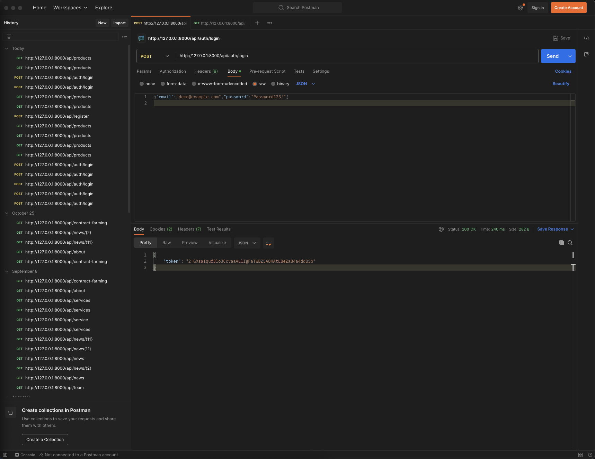
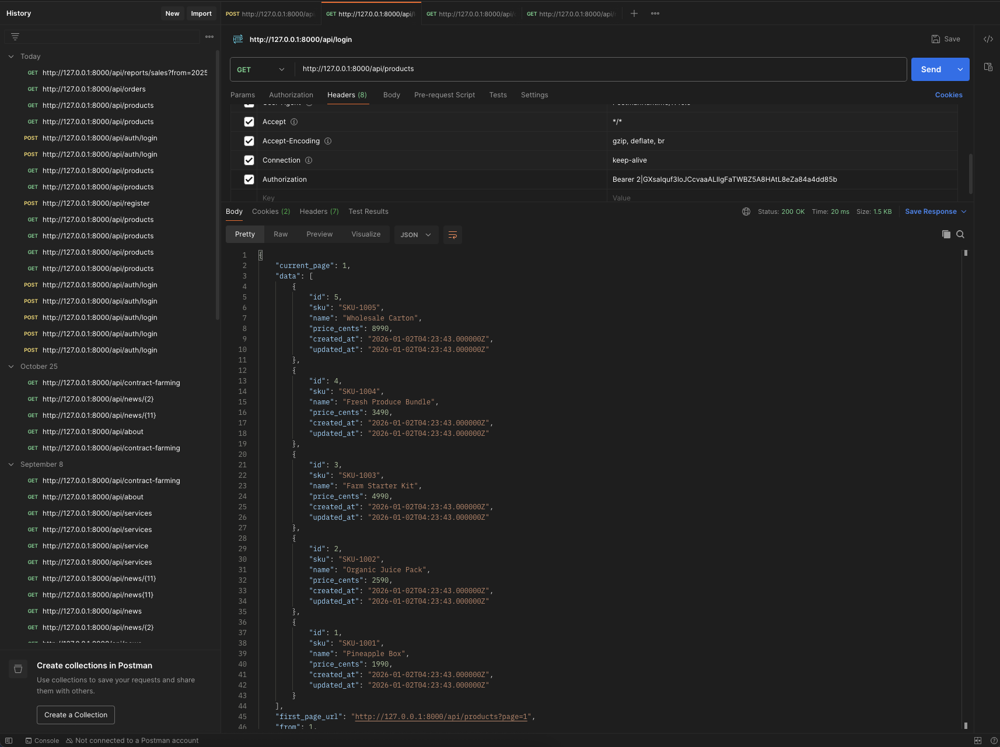
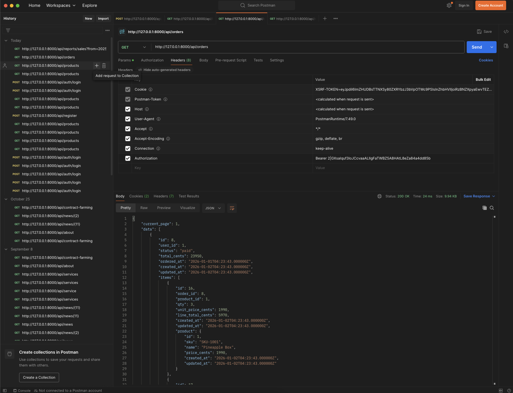
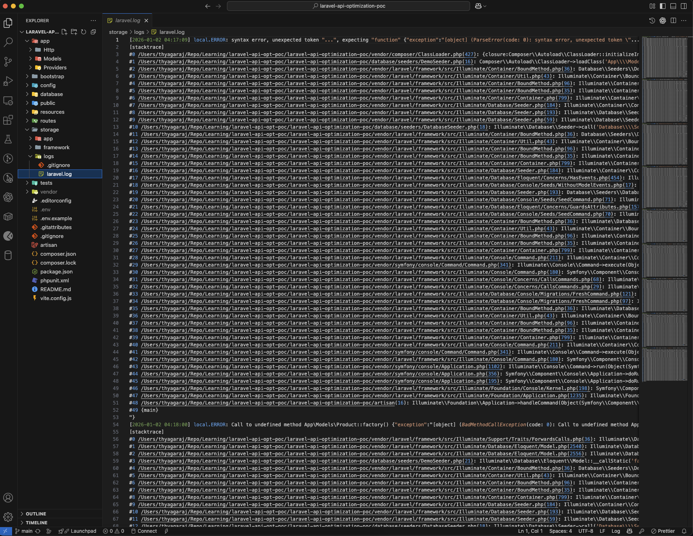

# Laravel API Optimization POC

A production-style **Laravel REST API Proof of Concept** showcasing secure authentication, optimized queries, and reporting endpoints.

This project simulates a real-world backend commonly used for internal dashboards or frontend applications that require fast, secure, and maintainable APIs.

---

## Features

- Token-based authentication using Laravel Sanctum
- Products API with pagination
- Orders API with nested order items
- Sales reporting API with date-range filtering
- Optimized database queries
- SQLite database with seeded demo data

---

## Tech Stack

- Laravel 12
- PHP 8.4
- Laravel Sanctum
- SQLite
- RESTful API

---

## Project Structure

```
app/
 └── Http/Controllers/Api/
     ├── AuthController.php
     ├── ProductController.php
     ├── OrderController.php
     └── ReportController.php

app/Models/
 ├── User.php
 ├── Product.php
 ├── Order.php
 └── OrderItem.php

database/
 ├── migrations/
 └── seeders/
     ├── DatabaseSeeder.php
     └── DemoSeeder.php

routes/
 ├── api.php
 ├── web.php
 └── console.php
```

---

## Local Setup

### Clone Repository
```
git clone https://github.com/Thyagaraj89/laravel-api-optimization-poc.git
cd laravel-api-optimization-poc
```

### Install Dependencies
```
composer install
```

### Environment Setup
```
cp .env.example .env
php artisan key:generate
```

Edit `.env`:
```
DB_CONNECTION=sqlite
DB_DATABASE=database/database.sqlite
```

### Create SQLite Database
```
mkdir -p database
touch database/database.sqlite
```

### Run Migrations & Seeders
```
php artisan migrate:fresh --seed
```

### Start Development Server
```
php artisan serve
```

Application will be available at:
```
http://127.0.0.1:8000
```

---

## Authentication

### Login
```
POST /api/auth/login
```

Request Body:
```
{
  "email": "demo@example.com",
  "password": "Password123!"
}
```

Response:
```
{
  "token": "YOUR_API_TOKEN"
}
```

Use this token for all protected endpoints:
```
Authorization: Bearer YOUR_API_TOKEN
Accept: application/json
```

---

## API Endpoints

### Products
```
GET /api/products
```

### Orders
```
GET /api/orders
```

### Sales Report
```
GET /api/reports/sales?from=2025-01-01&to=2026-12-31
```

Sample Response:
```
{
  "range": {
    "from": "2025-01-01",
    "to": "2026-12-31"
  },
  "orders_count": 15,
  "total_cents": 295300,
  "top_products": [
    {
      "sku": "SKU-1003",
      "qty_sold": 16,
      "revenue_cents": 79840
    }
  ]
}
```

---

## Screenshots

Authentication  


Products API  


Orders API  


Sales Report  


Logs


---

## Design Notes

- API-only backend (no Blade views)
- Clean separation of controllers, models, and routes
- Optimized queries to avoid N+1 problems

---

## Author

**Thyagaraj Thanaraj**  
Senior Backend / Full-Stack Engineer  
GitHub: https://github.com/Thyagaraj89
